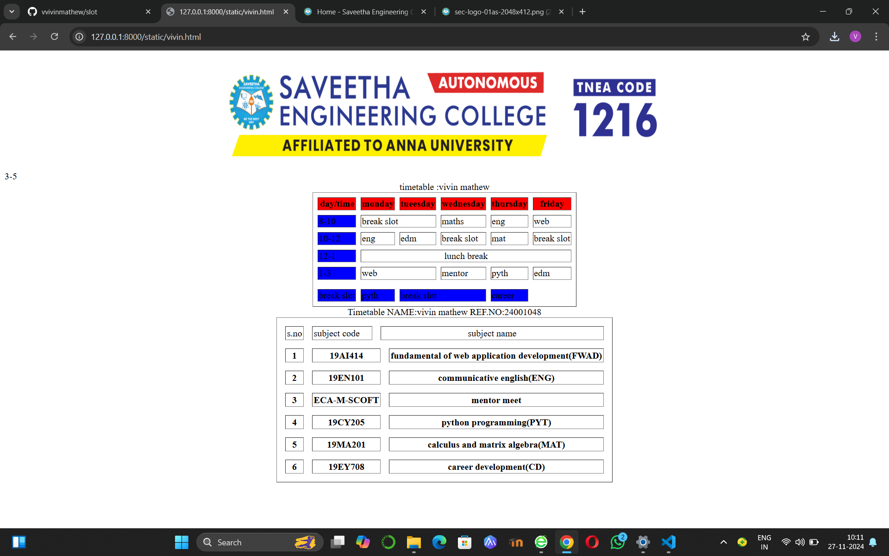

# Ex03 Time Table
## Date:

## AIM
To write a html webpage page to display your slot timetable.

## ALGORITHM
### STEP 1
Create a Django-admin Interface.

### STEP 2
Create a static folder and inert HTML code.

### STEP 3
Create a simple table using ```<table>``` tag in html.

### STEP 4
Add header row using ```<th>``` tag.

### STEP 5
Add your timetable using ```<td>``` tag.

### STEP 6
Execute the program using runserver command.

## PROGRAM
```
<html>
    <body>
        <map nname=</map>
        <table border="1" cellspacing="8" cellpading="2" align="center">
            <caption>timetable :vivin mathew</caption>
            <tr bgcolor="red">
                <th>day/time</th>
                <th>monday</th>
                <th>tueesday</th>
                <th>wednesday</th>
                <th>thursday</th>
                <th>friday</th>
            </tr>
            <tr>
                <td bgcolor="blue">8-10</td>
                <td colspan="2">break slot</td>
                <td>maths</td>
                <td>eng</td>
                <td>web</td>
            </tr>
            <tr>
                <td bgcolor="blue">10-12</td>
                <td>eng</td>
                <td>edm</td>
                <td>break slot</td>
                <td>mat</td>
                <td>break slot</td>
            </tr>
            <tr>
                <td bgcolor="blue">12-1</td>
                <td colspan="6"align="center">lunch break</td>
            </tr>
            <tr>
                <td bgcolor="blue">1-3</td>
                <td colspan="2">web</td>
                <td>mentor</td>
                <td>pyth</td>
                <td>edm</td>
            </tr>
            <tr>
                <tr bgcolor="blue">3-5</td>
                <td>break slot</td>
                <td>pyth</td>
                <td colspan="2">break slot</td>
                <td>career</td>
            </tr>
        </table>
        <table border="1" cellspacing="15" cellpadding="2" align="center">
            <caption>Timetable  NAME:vivin mathew    REF.NO:24001048</caption>
            <tr>
                <td>s.no</td>
                <td>subject code</td>
                <td colspan="4" align="center">subject name </td>
            </tr>
            <tr>
                <th>1</th>
                <th colspan="2">19AI414</th>
                <th colspan="3">fundamental of web application development(FWAD)</th>
            </tr>
            <tr>
                <th>2</th>
                <th colspan="2">19EN101</th>
                <th colspan="3">communicative english(ENG)</th>
            </tr>
            <tr>
                <th>3</th>
                <th colspan="2">ECA-M-SCOFT</th>
                <th colspan="3">mentor meet</th>
            </tr>
            <tr>
                <th>4</th>
                <th colspan="2">19CY205</th>
                <th colspan="3">python programming(PYT)</th>
            </tr>
            <tr>
                <th>5</th>
                <th colspan="2">19MA201</th>
                <th colspan="3">calculus and matrix algebra(MAT)</th>
            </tr>
            <tr>
                <th>6</th>
                <th colspan="2">19EY708</th>
                <th colspan="3">career development(CD)</th>
            </tr>
            
            
            
        
        </table>
    </body>
    
</html>
```
## OUTPUT



## RESULT
The program for creating slot timetable using basic HTML tags is executed successfully.
